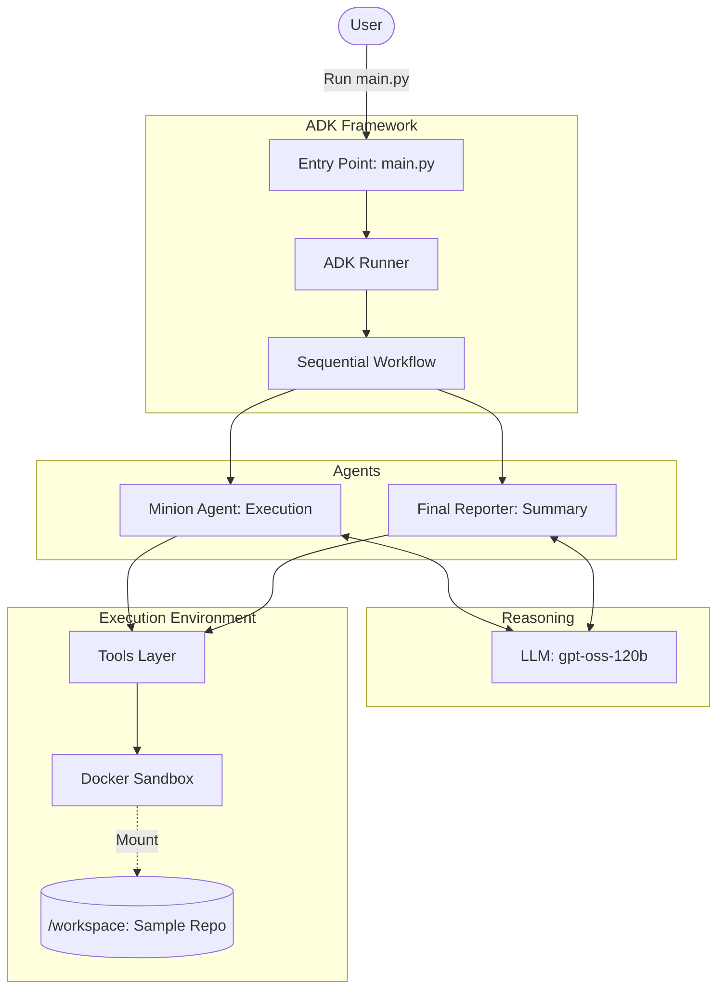

# Mini Minion - Autonomous Coding Agent
## System Documentation

### Overview
**Mini Minion** is an agentic AI system designed to autonomously resolve bugs in a codebase. It leverages a Large Language Model (LLM) as its reasoning engine, a set of specialized tools for file and system interaction, and a sandboxed Docker environment to ensure safe and isolated execution.

---

## 1. High-Level Design (HLD)

The system is built on a modular architecture where the lifecycle of an autonomous task is managed through a structured workflow.

- **Orchestration Layer**: The `main.py` entry point initializes the environment and hands off the task to the **ADK Runner**.
- **Intelligence Layer**: The **LLM (gpt-oss-120b)** acts as the brain, processing observations and deciding on the next tool to call.
- **Agent Layer**: A **Sequential Workflow** orchestrates two distinct agents: the **Minion Agent** (Execution) and the **Final Reporter Agent** (Summary).
- **Execution Layer**: A **Tools Layer** translates agent decisions into shell commands executed within an isolated **Docker Sandbox**.

---

## 2. High-Level Architecture Diagram

---

## 3. Core Components Detail

| Component | Responsibility |
| :--- | :--- |
| **main.py** | Boots the system, starts/stops Docker, and handles logging. |
| **ADK Runner** | Orchestrates the message flow between Agents and the LLM. |
| **Minion Agent** | The execution "muscle" (gpt-oss-120b) that performs the actual coding tasks. |
| **Tools Layer** | Python wrappers that bridge the Agent's intent with the Sandbox environment. |
| **Docker Sandbox** | A secure, ephemeral container containing the repo, Python, pytest, and git. |
| **Final Reporter** | Specialized agent that creates a clean, human-readable summary of changes. |

---

## 4. Key Concepts

- **Agentic Loop**: The "Reason → Act → Observe → Repeat" cycle allows the agent to learn from its own mistakes (e.g., failed tests) and adjust its approach.
- **Tool Calling**: Agents don't just "chat"; they interact with the world through structured function calling.
- **Sandbox Isolation**: Ensures that the agent's work remains within `/workspace` and does not affect the host system.
- **Feedback-Driven Correction**: The system relies on unit tests as the ultimate source of truth for "completion."
